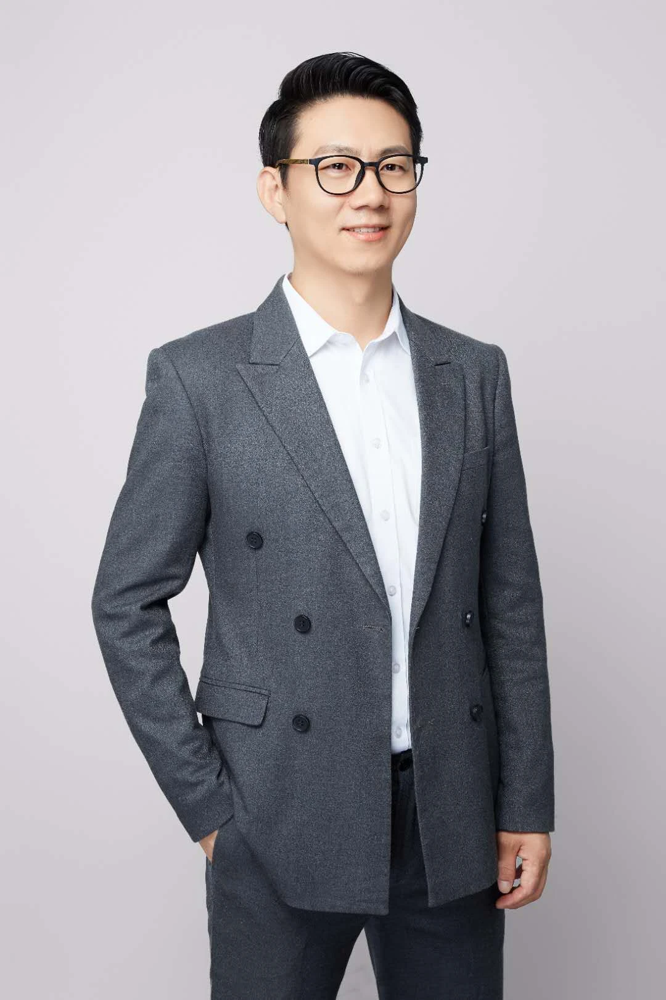

# 陈京昌 · 诗中

**把 AI 讲明白，带团队做出来。**

浙江大学人工智能学院教职工、造物云 AI 联合创始人，前钉钉初创产品专家、前支付宝 AI 客服团队核心。2007 年入行做产品，这两年主要在央国企和制造企业的现场，带"懂业务但不懂技术"的骨干把 AI 做成看得见、能验收的成果。

个人网站：[shizhong.me](https://shizhong.me)

## 现在在做什么

- **在带**：给几家央国企和制造企业做 AI 内训与项目伴跑。每期的标准只有一个——结营时每组手里有一个能发给同事验证的东西。
- **在写**：《AI 在企业分层落地》。老板、管理者、一线骨干、人力与数字化部门，各跑各的那一圈验证循环。23 章初稿已完成，过一章质检公开一章，写完免费送。
- **在开源**：把交付里反复用到的方法封装成可安装的 AI skill —— [sz-skills](https://github.com/jingchang0623-crypto/sz-skills)。
- **在教**：浙大人工智能学院的企业 AI 实训课。

## 一路做过什么

**2024 — 现在 · 央国企 AI 实训与落地**
半年几十期企业实训。一家运营商省公司连续 5 期复购；另一家运营商省公司 76 位一线骨干，5 周做出 7 个可路演的真实 AI 产品；一家世界 500 强装备制造央企的 78 位数智化骨干，过半零基础，半天当场跑通。两年内讲授过的客户还有省级公安机关、国有大型银行、烟草系统、大型产业集团与高校。客户信息一律脱敏，数字全部保留。

**创业 · 造物云 AI 联合创始人**
把多模态生成落到家电、家居、快消的真实行业：与京东、淘宝共建 AI 营销应用，为海尔、星巴克、顾家家居落地设计与营销内容生产。典型设计效率提升 40%，累计服务 100+ 企业客户与产业项目。

**浙江大学 · 产品创新智能设计中心副主任**
发起浙大产品创新团队，把平台级产品方法论带进校企共创与产业课题。

**阿里巴巴 · 支付宝 / 钉钉**
支付宝智能服务中台、AI 客服团队核心成员，支撑在线与电话服务日均 50 万咨询量的智能分流。钉钉初创期产品专家，智能办公应用平台 0-1：电话、视频会议、直播、文档、企业邮箱。

**2007 · 起点**
从工业设计与产品创新出发。红点、iF 国际设计大奖，阿里云认证讲师。

## 拿走用（全部免费，不用留联系方式）

- 《AI 落地诊断问卷》——12 题，10 分钟，哪些题答不上来本身就是诊断结果 → [在线阅读](https://shizhong.me/library/ai-diagnosis-questionnaire)
- sz-skills —— 诊断、选场景、做 MVP、路演评审，装进 Claude 即用 → [仓库](https://github.com/jingchang0623-crypto/sz-skills)
- 央国企实训现场的完整实录与给管理者的判断方法 → [shizhong.me/archive](https://shizhong.me/archive)
- 《AI 在企业分层落地》书稿 —— 质检通过后在这里陆续公开

## 商业关系，写在明处

我靠企业 AI 内训、项目伴跑和长期顾问收费。上面这些书、工具和实录免费，没有任何一处要你注册或留联系方式。想合作，带一个具体的业务问题来：[shizhong.me/work](https://shizhong.me/work)。

## 关于这个账号里的其他仓库

几十个标了 Archived 的 `openclaw-*`、`miaoquai-*` 和 fork 仓库，是 2026 年上半年做 AI agent 工具链探索时留下的实验，和企业 AI 落地这条主线无关，已归档留作记录。真正持续维护的只有 sz-skills 和书稿。
